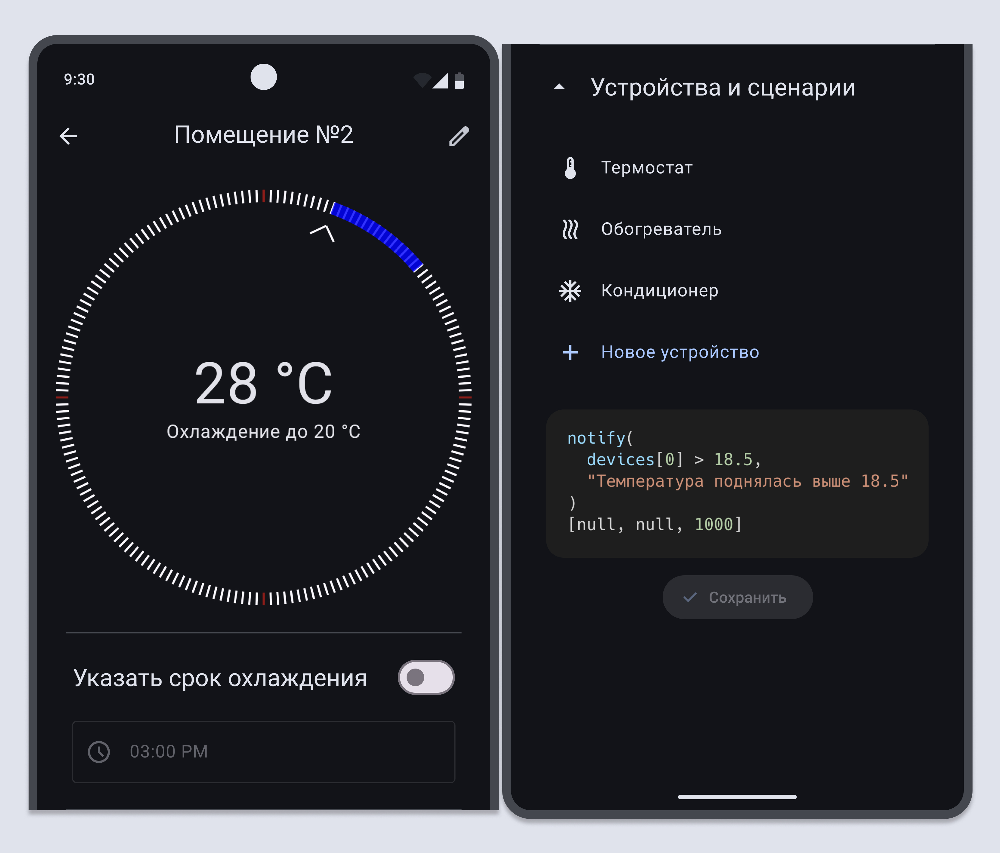
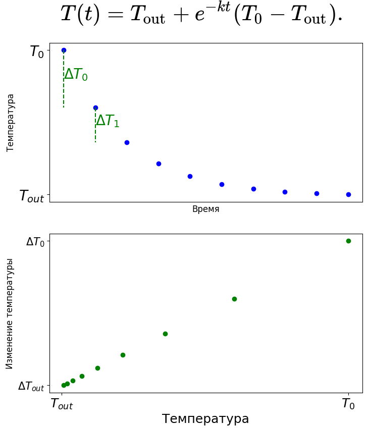

Андроид-клиент приложения для удалённого контроля систем отопления и кондиционирования воздуха.

[Репозиторий серверной части](https://github.com/Vhhg13/diplomaBackend).

[Figma](https://www.figma.com/design/X82GPPfMdeUwBwpdnqUZJm/Untitled?node-id=0-1&t=FniTXOR3EPJOoNd4-1).

# Возможности

## Управление и сценарирование для MQTT-устройств

Подключенными устройствами можно управлять при помощи контролов в приложении, либо через сценарии.

Сценарии позволяют задавать новые параметры работы устройств на основе текущих. Кроме того сценарии позволяют настраивать условия отправки push-уведомлений на устройства пользователя.

## Поддержание температуры при помощи линейной регрессии

Скорость охлаждения тела линейно зависит от температуры этого тела . Поэтому данные, получаемые с термостата используются для обучения модели линейной регрессии.

## JWT-авторизация

Пользовательские токены хранятся на устройстве. Таким образом нет необходимости в локальном хранении или шифровании паролей.

# Стек

- Jetpack Compose + Custom elements
- Dagger Hilt
- Ktor
- Kotlinx.Serialization
- Eclipse Mosquitto
- Jetpack DataStore
- Firebase Cloud Messaging
